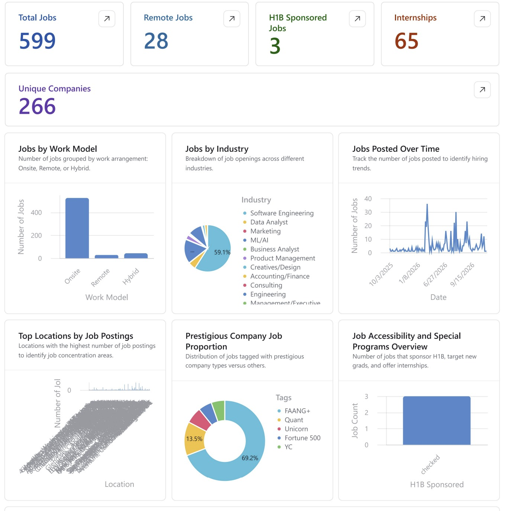

# JobsList - AI-Powered Job Aggregation Pipeline

A job aggregation pipeline that collects postings from multiple sources, scrapes job descriptions, uses Claude AI to extract structured fields, and syncs everything to an Airtable dashboard.



**[View the Airtable Dashboard](https://airtable.com/appcyGTbc7gA6BS0w/pagQAZFMZ12RLHjmb)**

## How It Works

```
Sources                    Pipeline                         Output
─────────                  ─────────                        ──────
Google Sheets CSV  ─┐
GitHub (Simplify)  ─┤      Step 1: Fetch Raw Jobs
Y Combinator       ─┼───►  Step 2: Scrape Job Descriptions  ───►  Airtable
JSearch API        ─┤      Step 3: AI Processing (Claude)          Dashboard
Ashby Job Boards   ─┘      Step 4: Sync to Airtable
```

### Pipeline Steps

| Step | What it does |
|------|-------------|
| **1. Fetch** | Pulls raw job listings from the selected source |
| **2. Scrape** | Visits each apply link and extracts the full job description |
| **3. AI Process** | Claude extracts work model, industry, H1B status, qualifications, and tags |
| **4. Sync** | Pushes enriched jobs to Airtable in batches |

### Job Sources

| Source | Auth | Description |
|--------|------|-------------|
| **Google Sheets** | None | CSV export from a public Google Sheet |
| **GitHub** | None | Parses SimplifyJobs/New-Grad-Positions README |
| **Y Combinator** | RapidAPI key | YC company job listings |
| **JSearch** | RapidAPI key | Broad job search API (Indeed, LinkedIn, etc.) |
| **Ashby** | None | Uses Ashby public posting API, then backend filters by keywords + publishedAt freshness |

## Quick Start

### Prerequisites

- Node.js 20+
- pnpm 9+
- Anthropic API key
- Airtable account + API key

### Setup

```bash
pnpm install

cp .env.example .env
# Edit .env with your API keys
```

### Environment Variables

| Variable | Required | Description |
|----------|----------|-------------|
| `ANTHROPIC_API_KEY` | Yes | Claude API key for AI processing |
| `AIRTABLE_API_KEY` | Yes | Airtable personal access token |
| `AIRTABLE_BASE_ID` | Yes | Your Airtable base ID |
| `RAPIDAPI_KEY` | For YC/JSearch | RapidAPI key for YC and JSearch sources |
| `CLAUDE_MODEL` | No | Defaults to `claude-3-5-haiku-20241022` |
| `JOB_COUNT` | No | Default number of jobs to fetch (default: 10) |
| `ASHBY_KEYWORDS` | No | Comma-separated keywords applied in backend filtering (default: `early career,sde,robotics`) |
| `ASHBY_PUBLISHED_WITHIN_HOURS` | No | Keep Ashby jobs with `publishedAt` in the last N hours (default: `24`) |
| `ASHBY_INCLUDE_COMPENSATION` | No | Calls Ashby with `includeCompensation=true` when enabled (default: `true`) |
| `ASHBY_REQUEST_DELAY_MS` | No | Delay between Ashby company requests to stay within fair use (default: `1000`) |

### Run Locally

```bash
# Start both backend and frontend in dev mode
pnpm dev
```

- Backend: http://localhost:3001
- Frontend: http://localhost:5173

## Project Structure

```
JobsList/
├── backend/
│   └── src/
│       ├── services/          # Fetchers (CSV, GitHub, YC, JSearch, Ashby public API)
│       │                      # Ashby filter logic, scraper, AI processor, Airtable sync
│       ├── routes/            # Pipeline + data API routes
│       ├── constants/         # Industry categories
│       ├── config.ts          # Environment config
│       ├── store.ts           # JSON file persistence
│       └── index.ts           # Fastify server
├── frontend/
│   └── src/
│       ├── components/        # Pipeline UI (StepPanel, StepButton, etc.)
│       └── hooks/             # API hooks
├── render.yaml                # Render deployment config
└── docs/
    └── api.md                 # API documentation
```

## API Endpoints

| Endpoint | Method | Description |
|----------|--------|-------------|
| `/api/health` | GET | Health check |
| `/api/pipeline/step1?source=<src>` | POST | Fetch raw jobs (Ashby supports `companies`, `keywords`, `postedToday`, `publishedWithinHours`, `limit`) |
| `/api/pipeline/step2` | POST | Scrape job descriptions |
| `/api/pipeline/step3` | POST | AI process with Claude |
| `/api/pipeline/step4` | POST | Sync to Airtable |
| `/api/pipeline/status` | GET | Get all step statuses |
| `/api/pipeline/reset` | POST | Clear all data |
| `/api/data/:step` | GET | Get output from step 1-4 |
| `/api/logs/stream` | GET | SSE real-time log stream |


### Ashby Smart Ingestion Request Example

```bash
# Fetch the newest 25 jobs posted today that match keywords from selected Ashby companies
curl -X POST "http://localhost:3001/api/pipeline/step1?source=theirstack&companies=openai,notion,cursor&keywords=sde,robotics&postedToday=true&limit=25"
```

- `companies`: comma-separated Ashby slugs to search (omit to search all configured companies)
- `keywords`: comma-separated keywords (omit to use `ASHBY_KEYWORDS`)
- `postedToday=true`: keep only jobs whose `publishedAt` date is today (UTC)
- `publishedWithinHours`: optional alternative to `postedToday` (e.g., `24`)
- No API key is required for Ashby public job board ingestion.


### Ashby Slug Discovery (Local-Only)

The Ashby fetcher reads slugs from [backend/data/ashby-slugs.json](backend/data/ashby-slugs.json). To grow that list, run the Playwright-based slug finder **locally** — it searches Google for `site:jobs.ashbyhq.com`, extracts candidate slugs, validates them against Ashby's posting API, and merges new entries into the JSON.

```bash
cd backend

# Default: plain fetch; auto-falls back to Playwright (headful) if Google throttles.
npx tsx src/services/ashby-slug-finder.ts

# Force Playwright. A Chromium window opens. If Google shows a CAPTCHA, solve it
# in the window — the script waits up to 2 min and cookies persist for future runs.
npx tsx src/services/ashby-slug-finder.ts --playwright

# Fully headless (higher block rate, useful after cookies are warmed up).
npx tsx src/services/ashby-slug-finder.ts --playwright --headless
```

After a run, commit the updated `backend/data/ashby-slugs.json` and push. In production, [backend/src/services/ashby-direct-fetcher.ts](backend/src/services/ashby-direct-fetcher.ts) consumes the committed file on each pipeline run — no browser or Playwright install required in prod.

**Why local-only:** Playwright ships with ~170MB of browser binaries and Google aggressively blocks datacenter IPs. It lives in `devDependencies` and the persistent browser profile (`backend/data/.playwright-profile/`) is gitignored.

## AI Processing

Claude (Haiku) extracts from each job:
- **Work Model** — Remote / Hybrid / Onsite
- **Industry** — 22 categories (Software Engineering, ML/AI, Finance, etc.)
- **H1B Sponsorship** — explicit mention required
- **Qualifications** — key requirements summary
- **Tags** — auto-detected: FAANG+, Quant, Fortune 500, Unicorn, YC, Crypto/Web3
- **Job Board** — Lever, Ashby, Greenhouse, LinkedIn, Workday

## Deployment (Render)

The app deploys as a single service on Render's free tier:

1. Push to GitHub
2. Go to [dashboard.render.com](https://dashboard.render.com) → **New** → **Blueprint**
3. Connect your repo — Render auto-detects `render.yaml`
4. Set secret env vars: `ANTHROPIC_API_KEY`, `AIRTABLE_API_KEY`, `AIRTABLE_BASE_ID`, `RAPIDAPI_KEY`
5. Deploy

In production, the backend serves the frontend static build, so everything runs from a single URL.

## License

MIT
